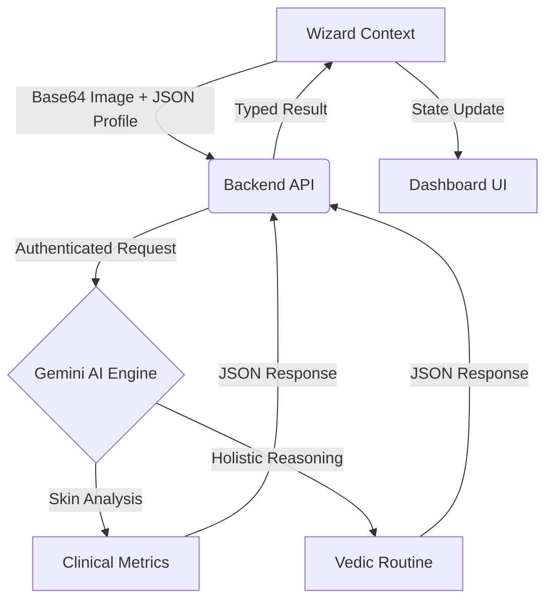

# Skinveda - Application Flow & Structure

This document provides a comprehensive overview of the **Skinveda** application's architecture, folder structure, and the logic behind the user experience flow.

---

## 📂 Project Structure

The project is organized into a modular architecture, separating the mobile frontend (Expo), the backend services (Express), and reference/prototype code.

### 📱 Frontend (Expo / React Native)
- **`app/`**: Core routing using Expo Router.
  - **`(auth)/`**: Authentication flow (Sign-in, Sign-up with custom OAuth handling).
  - **`(wizard)/`**: The 7-step AI Skin Analysis flow.
  - **`index.tsx`**: Immersive landing page with video background.
  - **`profile.tsx`**: User settings and Clerk profile management.
- **`components/`**: Reusable UI components.
  - **`ui/`**: Base design primitives.
  - **`wizard/`**: Specific components for the analysis flow (ProgressBar, MetricBars, etc.).
- **`contexts/`**: Global state management (e.g., `WizardContext` for multi-step data persistence).
- **`services/`**: API clients and integration logic (`apiClient.ts`).
- **`constants/`**: Unified design system tokens (`theme.ts`, `wizardOptions.ts`).
- **`hooks/`**: Custom logic for theme detection and color management.

### ⚙️ Backend (Node.js / Express)
- **`backend/src/`**
  - **`controllers/`**: Logic for analysis and TTS generation.
  - **`services/`**: AI engine integration (Gemini API).
  - **`middleware/`**: Security and Clerk JWT authentication.
  - **`routes/`**: API endpoint definitions (`/api/analyze`, `/api/tts`).

---

## 🔄 Complete User Flow

Skinveda follows a purposeful journey designed to transition users from discovery to personalized skin wisdom.

### 1. Discovery & Authentication
- **Landing Page**: Users are greeted with an immersive video experience.
- **Onboarding**: Users sign up via Clerk. If using OAuth (Google/GitHub), a custom modal ensures a username is captured for a personalized experience.

### 2. The 7-Step Skin Analysis Wizard
The wizard uses `WizardContext` to persist progress using `AsyncStorage`, allowing users to resume where they left off.

1.  **Welcome (`welcome.tsx`)**: High-level introduction to the "face scan to wisdom" process.
2.  **Identity (`profile-name.tsx`)**: Capturing the user's name for personalized reporting.
3.  **Profile (`profile-bio.tsx`)**: Basic demographics (Age, Gender) to calibrate AI analysis.
4.  **Skin Foundation (`skin-details.tsx`)**: Self-reported skin type and sensitivity levels.
5.  **Health & Concerns (`concerns-health.tsx`)**: Capturing specific concerns (Acne, Aging) and health data (Sleep, Stress) for holistic analysis.
6.  **Face Capture (`photo-capture.tsx`)**: Integrated camera interface with an oval guide for high-quality facial imaging.
7.  **Consultation Dashboard (`dashboard.tsx`)**:
    - **AI Processing**: Data is sent to the backend for multimodal analysis.
    - **Visual Results**: Dynamic metric bars showing Acne, Hydration, Sensitivity, etc.
    - **Holistic Routine**: Personalized recommendations for CTM (Cleanse/Tone/Moisturize), Diet, Exercise, and Meditation.

---

## 🧠 AI & Integration Logic

### Data Processing Flow


### Key Technologies
- **Clerk Expo**: Secure, branded authentication with session persistence.
- **Google Gemini**:
  - `gemini-3-flash-preview`: The core multimodal engine for image and data analysis.
  - `gemini-2.5-flash-preview-tts`: Provides natural voice guidance throughout the wizard.
- **Expo Camera**: Custom-built capture interface with real-time UI overlays.
- **Expo Secure Store**: Securely caching Clerk tokens and sensitive session data.

---

## 🛠 Maintenance & Development

- **Environment**: Ensure `.env` files in both root and `backend/` are configured (Clerk Keys, Gemini Key).
- **Backend Run**: `cd backend && npm run dev`
- **Frontend Run**: `npx expo start`

---

## 🛠 Troubleshooting Network Issues

If you see **"Network request failed"** during skin analysis:

1.  **Check Backend**: Ensure the backend is running (`cd backend && npm run dev`).
2.  **Verify IP Address**:
    - If testing on a **physical device**, you cannot use `localhost`.
    - Find your computer's local IP (e.g., `192.168.1.XX`).
    - Create/Update `.env` in the root folder:
      ```bash
      EXPO_PUBLIC_BACKEND_URL=http://192.168.1.XX:3000
      ```
3.  **Android Emulator**: Use `http://10.0.2.2:3000` as the backend URL if `localhost` fails.
4.  **Firewall**: Ensure your computer allows incoming connections on port 3000.

---


*Last Updated: January 2026*
